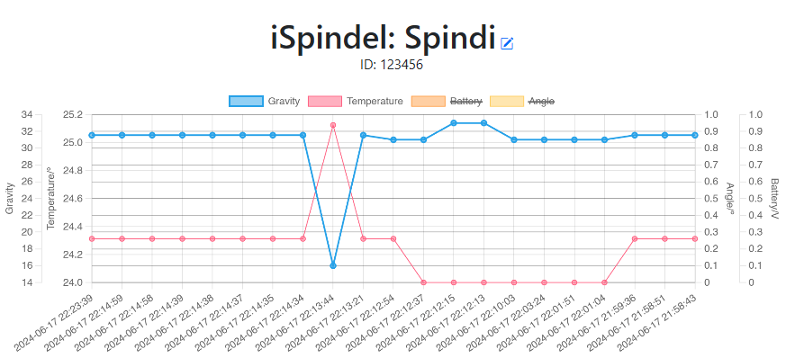
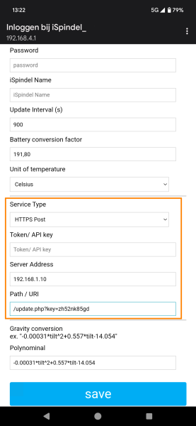
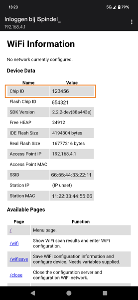
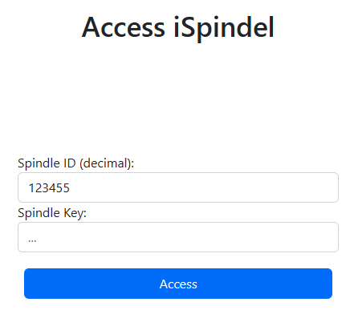

# iSpindel Visualizer

The iSpindel Visualizer is a simple, easy to use chart display of [iSpindel](https://www.ispindel.de) measurement data using Flask, SQLite, Bootstrap and chart.js.
This is the Flask version of the iSpindel Visualizer. For some people it may be easier for them to setup a local Flask app running instead of a PHP environment.

## Prerequisites

- Python 3.6 or higher
- Git
- Docker (optional, for Docker installation)

## Installation

You can choose between plain python install or build and use the docker container.

Plain install: 
Use the app from the app folder and create a virtual enviroment as described:

    python -m venv ivisu
    cd ivisu
    git clone https://github.com/3komma3volt/iSpindelVisualizeriSpindelVisualizer-Flask.git
    cd iSpindelVisualizeriSpindelVisualizer-Flask
    ..\Scripts\activate
    pip install -r requirements.txt
    python app.py

Or the docker install:

Build the container using

    docker build -t ispindel-visualizer .  

Run the container:

    docker run -p 80:80 ispindel-visualizer

## Usage

In the iSpindel configuration select **HTTPS Post**, as server address use the address of the server on which the visualizer is installed. It also works great on a local XAMPP installation.

As path use **/update?key=...**
  
The key is a kind of a password to protect your data. You can use any alphanumerical sequence and special characters with any length. Example: sz89Bd96$iogf

The first time a iSpindel connects, it will automatically registered and the key will be stored for future key checks and logins.

  

The system use the iSpindle ID for accessing its data. You can find it on the information page of the iSpindel.

The name which is stored in the iSpindel will be used for its alias name.

## Accessing Data

Open your webbrowser and enter URL: http://127.0.0.1:5000 (or :80 for docker install)
  
To access your data, simply log-in using your iSpindel ID and your self chosen key.

## Troubleshooting

If you encounter any issues during installation or usage, please check the following:

- Ensure all prerequisites are installed.
- Verify that the virtual environment is activated.
- Check the Flask server logs for any error messages.
- Ensure the Docker container is running if using Docker installation.

